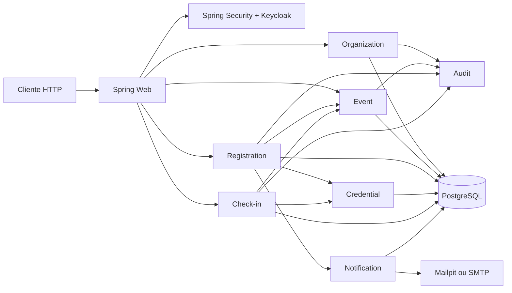

# Arquitetura do EventOps

## Escolha principal

O EventOps e um monolito modular. O dominio ainda precisa de consistencia transacional forte entre evento, inscricao, credencial e fila; separar esses componentes em microsservicos adicionaria sagas, contratos remotos e falhas distribuidas sem beneficio proporcional.



## Modulos

| Modulo | Responsabilidade |
|---|---|
| `organization` | organizacoes, membros e papeis locais |
| `event` | ciclo de vida, dados publicos e capacidade |
| `registration` | inscricao, fila, convite, indicacao e ranking |
| `credential` | emissao, hash, renovacao, revogacao e QR Code |
| `checkin` | consumo idempotente da credencial |
| `notification` | notificacao e outbox retomavel |
| `audit` | trilha append-only de operacoes relevantes |
| `shared` | erros, ator atual, token, normalizacao e pagina |

`ArchitectureTest` usa Spring Modulith e ArchUnit para impedir ciclos e acessos indevidos aos pacotes `internal`.

## Consistencia de capacidade

A vaga nao e calculada com `COUNT` seguido de `INSERT`. O EventOps executa uma unica atualizacao condicional:

```sql
UPDATE eventos
SET vagas_ocupadas = vagas_ocupadas + 1
WHERE id = ?
  AND status = 'PUBLICADO'
  AND (capacidade IS NULL OR vagas_ocupadas < capacidade);
```

Somente uma transacao consegue reservar a ultima vaga. Se nenhuma linha for atualizada e o evento ainda aceitar inscricoes, a pessoa entra na fila.

## Check-in idempotente

A combinacao `ator + operacao + Idempotency-Key` e unica. A primeira transacao reserva a chave, grava check-in e resposta. Uma repeticao com o mesmo corpo recebe a resposta anterior; uma repeticao com corpo diferente recebe `409`.

Tambem existe unicidade por `inscricao_id`, protegendo contra duas chaves diferentes para a mesma credencial.

## Outbox

A notificacao e o evento outbox nascem na mesma transacao da regra de negocio. O processador reivindica lotes com `FOR UPDATE SKIP LOCKED`, envia por SMTP e aplica retry exponencial. Itens em `PROCESSANDO` por mais de cinco minutos podem ser retomados por outra instancia.

## Seguranca

- Keycloak emite JWT; a API atua somente como Resource Server.
- A autenticacao identifica a pessoa; a tabela `membros_organizacao` define o acesso ao tenant.
- `PROPRIETARIO` administra tudo, `GESTOR_EVENTO` opera eventos e `OPERADOR_CHECKIN` acessa somente operacao.
- QR Code carrega token aleatorio opaco, nunca ID sequencial nem dados pessoais.
- Tokens de convite, credencial e cancelamento sao persistidos apenas como hash SHA-256.
